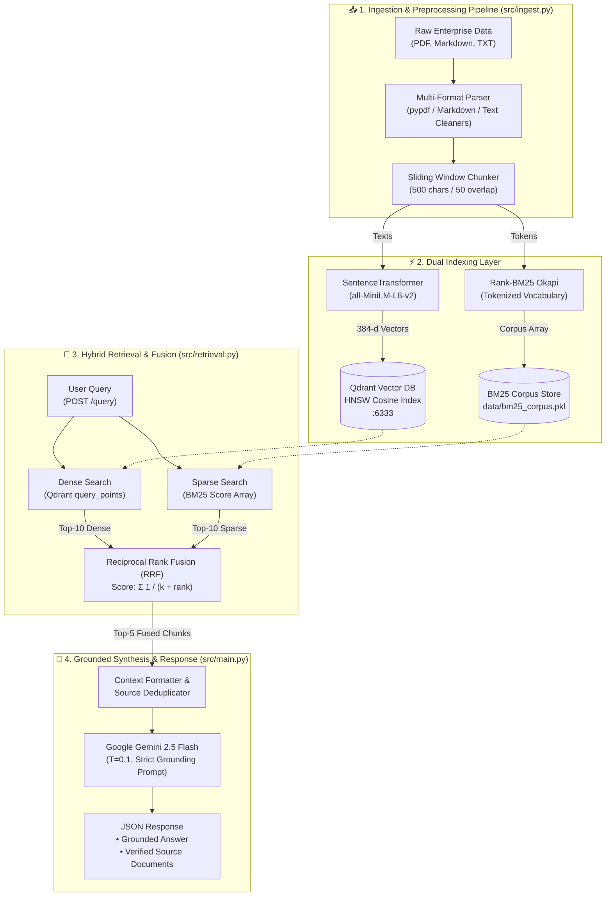
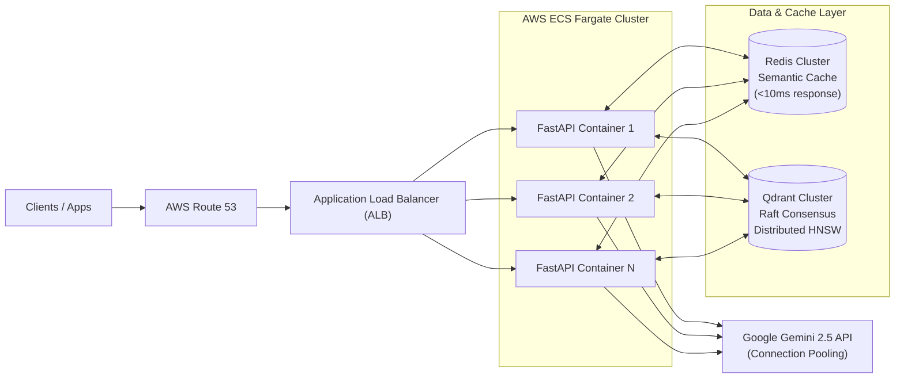

# 🧠 VoxContextEngine

<div align="center">

[](https://www.python.org/)
[](https://fastapi.tiangolo.com/)
[](https://qdrant.tech/)
[](https://ai.google.dev/)
[](https://huggingface.co/sentence-transformers/all-MiniLM-L6-v2)
[](https://www.docker.com/)
[](LICENSE)

<br />

**A Production-Grade, Document-Grounded Hybrid RAG (Retrieval-Augmented Generation) Engine Combining Dense Vector Embeddings, Sparse Keyword Matching (BM25), Reciprocal Rank Fusion (RRF), and Strict LLM Grounding.**

[Features](#-core-features--capabilities) • [Architecture](#-system-architecture) • [How It Works](#-how-it-works-the-hybrid-rag-pipeline) • [Tech Stack](#-technology-stack) • [Installation](#-installation--getting-started) • [API Reference](#-api-reference) • [Production Scaling](#-production-scaling-blueprint-50000-daus)

</div>

---

## 📑 Table of Contents

- [Overview: What is VoxContextEngine?](#-overview-what-is-voxcontextengine)
- [Why VoxContextEngine? The Problem & Value Proposition](#-why-voxcontextengine-the-problem--value-proposition)
- [System Architecture](#-system-architecture)
  - [High-Level Architecture Diagram](#high-level-architecture-diagram)
  - [The Hybrid Search Advantage](#the-hybrid-search-advantage)
  - [Reciprocal Rank Fusion (RRF) Formulation](#reciprocal-rank-fusion-rrf-formulation)
- [Core Features & Capabilities](#-core-features--capabilities)
- [How It Works: The Hybrid RAG Pipeline](#-how-it-works-the-hybrid-rag-pipeline)
  - [1. Multi-Format Ingestion & Sliding Window Chunking](#1-multi-format-ingestion--sliding-window-chunking)
  - [2. Dual Indexing: Dense HNSW Vectors & Sparse BM25](#2-dual-indexing-dense-hnsw-vectors--sparse-bm25)
  - [3. Hybrid Retrieval & Rank Fusion](#3-hybrid-retrieval--rank-fusion)
  - [4. Zero-Hallucination Grounded Generation](#4-zero-hallucination-grounded-generation)
- [Technology Stack](#-technology-stack)
- [Prerequisites](#-prerequisites)
- [Installation & Getting Started](#-installation--getting-started)
  - [Option A: Docker Compose Setup (Recommended)](#option-a-docker-compose-setup-recommended)
  - [Option B: Local Native Setup](#option-b-local-native-setup)
- [Configuration & Environment Variables](#-configuration--environment-variables)
- [API Reference](#-api-reference)
- [Evaluation & Verification Benchmarks](#-evaluation--verification-benchmarks)
- [Project Directory Structure](#-project-directory-structure)
- [Production Scaling Blueprint (50,000 DAUs)](#-production-scaling-blueprint-50000-daus)
- [Engineering Design Decisions & Trade-offs](#-engineering-design-decisions--trade-offs)
- [Contributing & License](#-contributing--license)

---

## 💡 Overview: What is VoxContextEngine?

**VoxContextEngine** is an enterprise-ready, high-accuracy **Retrieval-Augmented Generation (RAG)** engine designed to deliver deterministic, hallucination-resistant knowledge synthesis over private enterprise document repositories.

While standard RAG systems rely solely on dense semantic vector similarity (which frequently misses exact keyword terms, product IDs, technical acronyms, or specific version strings), VoxContextEngine implements a **state-of-the-art Hybrid Retrieval architecture**:
1. **Dense Vector Search**: Powered by `sentence-transformers/all-MiniLM-L6-v2` and containerized **Qdrant** HNSW vector indices (384-dimensional cosine similarity) to capture deep conceptual context and semantic relationships.
2. **Sparse Lexical Search**: Powered by **Rank-BM25 (`BM25Okapi`)** to guarantee exact keyword precision and token matching.
3. **Reciprocal Rank Fusion (RRF)**: Merges disparate rank distributions using mathematical score normalization ($k=60$) to construct an optimal context window.
4. **Strict Context-Locked Generation**: Invokes **Google Gemini 2.5 Flash** with constrained temperatures ($T=0.1$) and explicit system guardrails, ensuring that answers are derived *strictly* from retrieved source documents. If information is absent, the engine explicitly declines to guess, eliminating hallucination risk.

---

## 🎯 Why VoxContextEngine? The Problem & Value Proposition

### The Limitations of Traditional RAG

Standard enterprise RAG pipelines fail in production due to two fundamental flaws:

```
❌ Pure Dense Vector Search Pitfall:
   Query: "What are the configuration flags for CHUNK_OVERLAP in v2.1?"
   -> Dense embeddings match the concept of "file chunking" but miss the exact variable token 'CHUNK_OVERLAP'.
   
❌ Pure Lexical / Keyword Search Pitfall:
   Query: "How does the platform prevent memory overflows on large documents?"
   -> BM25 fails if the document uses words like "sliding window chunking" or "resource limits" without the exact phrase "memory overflow".
```

### The VoxContextEngine Solution

| Dimension | Pure Dense RAG | Pure Keyword Search | VoxContextEngine (Hybrid RAG + RRF) |
| :--- | :--- | :--- | :--- |
| **Semantic Understanding** | ✅ High | ❌ None | ✅ **High** (384-d Cosine Vector Space) |
| **Exact Token / Acronym Matching** | ❌ Poor | ✅ High | ✅ **Flawless** (BM25 Okapi Scoring) |
| **Rank Aggregation** | ❌ Single vector score | ❌ Single BM25 score | ✅ **Reciprocal Rank Fusion ($k=60$)** |
| **Hallucination Control** | ⚠️ High risk if irrelevant | ⚠️ High risk if missing | 🛡️ **Zero-Hallucination Guardrails ($T=0.1$)** |
| **Source Attribution** | ⚠️ Inconsistent | ⚠️ Inconsistent | 📌 **Exact Source Tracking & Deduplication** |
| **Deployment Footprint** | ❌ Heavy / Costly | ✅ Light | ⚡ **Ultra-fast & Resource-efficient (Dockerized)** |

---

## 🏗️ System Architecture

### High-Level Architecture Diagram



### The Hybrid Search Advantage

By querying both **dense embeddings** and **sparse BM25 indices** concurrently, VoxContextEngine guarantees that queries containing both abstract conceptual questions (*"Explain data compliance principles"*) and specific technical identifiers (*"Postgres 16 connection pool port"*) retrieve the exact matching chunks.

### Reciprocal Rank Fusion (RRF) Formulation

Reciprocal Rank Fusion combines the ranked outputs of multiple information retrieval systems without requiring raw score normalization (which is notoriously error-prone when mixing cosine similarities $[0, 1]$ with unbounded BM25 scores $[0, \infty)$):

$$RRF\_Score(d \in D) = \sum_{m \in M} rac{1}{k + r_m(d)}$$

Where:
- $M$ is the set of retrieval systems (Dense Vector Search + BM25 Sparse Search).
- $r_m(d)$ is the 1-based rank position of document $d$ in retrieval system $m$.
- $k = 60$ is the smoothing constant that prevents high-ranking outliers from dominating the blended score.

---

## ✨ Core Features & Capabilities

- 📄 **Multi-Format Document Ingestion**: Native parsing for `.pdf` (via `pypdf`), `.md` (with markdown syntax stripping), and `.txt` enterprise records.
- ✂️ **Sliding Window Chunking**: Predictable 500-character chunk sizes with 50-character overlaps (~70-90 tokens per chunk) to preserve contextual boundaries without exceeding embedding sequence limits.
- 🎯 **384-Dimensional Dense Embeddings**: Utilizes `all-MiniLM-L6-v2` for blazing inference speeds and ultra-low RAM footprint while retaining rich semantic relationships.
- 🗄️ **Containerized Qdrant Vector Engine**: Real-time HNSW vector indexing, payload metadata storage, and instant collection recreation.
- 🔍 **BM25 Sparse Keyword Matcher**: In-memory tokenized BM25Okapi scoring serialized via pickle for instant cold-start loading during server startup.
- 🔀 **Mathematical Reciprocal Rank Fusion**: Merges the top 10 dense candidates and top 10 sparse candidates into a high-precision top 5 context pool.
- 🛡️ **Zero-Hallucination Guardrails**: Employs **Gemini 2.5 Flash** with low temperature ($T=0.1$) and explicit refusal directives (*"If information is insufficient, state that you do not have sufficient information"*).
- 📌 **Transparent Source Tracking**: Every response includes an array of deduplicated source file names directly backing the generated synthesis.
- 📊 **Automated Benchmark Evaluation Suite**: Built-in test suite (`src/evaluate.py`) validating latency, response status, source attribution, and safety across standard corporate benchmark queries.
- 🐳 **Full Docker & Docker Compose Support**: Production-grade multi-container orchestrations with CPU-optimized PyTorch wheels and volume persistence.

---

## 💻 Technology Stack

| Component | Technology | Version | Purpose |
| :--- | :--- | :--- | :--- |
| **API Framework** | **FastAPI** | `>=0.111.0` | Asynchronous REST endpoints, OpenAPI documentation & lifespan events |
| **ASGI Server** | **Uvicorn** | `>=0.30.1` | High-throughput asynchronous Python web server |
| **Vector Database** | **Qdrant** | `>=1.9.1` | Distributed HNSW vector search engine with payload filtering |
| **Dense Embeddings**| **Sentence-Transformers**| `>=3.0.1` | Local embedding model (`all-MiniLM-L6-v2`, 384 dimensions) |
| **Sparse Keyword Search**| **Rank-BM25** | `>=0.2.2` | Lexical Okapi BM25 scoring algorithm |
| **LLM Synthesis** | **Google GenAI SDK** | `>=0.1.1` | **Gemini 2.5 Flash** generation with strict system instructions |
| **Data Validation** | **Pydantic** | `>=2.7.4` | Strict request/response schema modeling and validation |
| **Document Parsers**| **pypdf / Markdown** | `>=4.2.0` | Ingesting raw PDF, MD, and TXT corporate files |
| **Containerization**| **Docker & Docker Compose**| `3.8+` | Containerized Qdrant & FastAPI microservice deployment |

---

## 📦 Prerequisites

Before running VoxContextEngine, ensure you have:
1. **Docker & Docker Desktop** (for Qdrant containerization) or Docker Engine on Linux.
2. **Python 3.11+** installed locally.
3. A **Google Gemini API Key** (obtainable from [Google AI Studio](https://aistudio.google.com/)).

---

## 🚀 Installation & Getting Started

### Option A: Docker Compose Setup (Recommended)

The easiest way to run VoxContextEngine with all dependencies and Qdrant pre-configured:

1. **Clone the repository**:
   ```bash
   git clone https://github.com/RudraSharma3/vox-context-engine.git
   cd vox-context-engine
   ```

2. **Set your Gemini API Key**:
   - **Windows (PowerShell):**
     ```powershell
     $env:GEMINI_API_KEY="your-gemini-api-key-here"
     $env:GOOGLE_API_KEY="your-gemini-api-key-here"
     ```
   - **Linux / macOS:**
     ```bash
     export GEMINI_API_KEY="your-gemini-api-key-here"
     export GOOGLE_API_KEY="your-gemini-api-key-here"
     ```

3. **Launch the full containerized stack**:
   ```bash
   docker compose up --build -d
   ```

4. **Verify running containers**:
   ```bash
   docker compose ps
   ```
   - **FastAPI RAG API**: `http://localhost:8000`
   - **Interactive API Docs**: `http://localhost:8000/docs`
   - **Qdrant Vector DB Dashboard**: `http://localhost:6333/dashboard`

---

### Option B: Local Native Setup

1. **Create and activate a virtual environment**:
   - **Windows (PowerShell):**
     ```powershell
     python -m venv .venv
     .\.venv\Scripts\Activate.ps1
     ```
   - **macOS / Linux:**
     ```bash
     python3 -m venv .venv
     source .venv/bin/activate
     ```

2. **Install Python dependencies**:
   ```bash
   pip install -r requirements.txt
   ```

3. **Start the Qdrant Vector Database**:
   ```bash
   docker compose up -d qdrant
   ```

4. **Set your Environment Variables**:
   ```powershell
   $env:GEMINI_API_KEY="your-gemini-api-key-here"
   $env:QDRANT_HOST="localhost"
   $env:QDRANT_PORT="6333"
   ```

5. **Run the Ingestion Pipeline**:
   Index the documents in the `data/` folder:
   ```bash
   python -m src.ingest
   ```
   *Output: Extracts text, computes 384-d embeddings, pushes vectors to Qdrant, and builds `data/bm25_corpus.pkl`.*

6. **Start the Application Server**:
   ```bash
   python -m src.main
   ```
   *Server live at `http://127.0.0.1:8000`.*

7. **Execute the Evaluation Suite**:
   In a separate terminal, benchmark the engine across test cases:
   ```bash
   python -m src.evaluate
   ```

---

## ⚙️ Configuration & Environment Variables

All core runtime parameters are centrally defined in `src/config.py` and can be overridden via environment variables:

| Variable | Type | Default | Description |
| :--- | :---: | :--- | :--- |
| `GEMINI_API_KEY` | `str` | *(Required)* | Google Gemini API key for LLM answer synthesis |
| `GOOGLE_API_KEY` | `str` | *(Required)* | Fallback key for Google GenAI SDK client binding |
| `QDRANT_HOST` | `str` | `localhost` | Hostname / IP address of the Qdrant vector database |
| `QDRANT_PORT` | `int` | `6333` | REST port for Qdrant vector database API |
| `CHUNK_SIZE` | `int` | `500` | Target character length per text chunk (~70-90 tokens) |
| `CHUNK_OVERLAP` | `int` | `50` | Sliding window character overlap between adjacent chunks |
| `COLLECTION_NAME`| `str` | `enterprise_knowledge_base`| Name of the Qdrant vector collection |
| `EMBEDDING_MODEL_NAME` | `str` | `all-MiniLM-L6-v2` | SentenceTransformers model for dense embeddings |

---

## 📡 API Reference

### 🔍 Query Endpoint: `POST /query`

Executes hybrid retrieval across indexed documents, aggregates candidate chunks via Reciprocal Rank Fusion, and returns a strictly grounded response.

#### Request Headers
```http
Content-Type: application/json
```

#### Request Body
```json
{
  "question": "What pricing plan includes API access?"
}
```

#### Response Body (`200 OK`)
```json
{
  "answer": "API access is included exclusively in the Enterprise pricing tier, which starts at $499/month and provides unlimited queries, custom rate limits, and 24/7 dedicated support.",
  "sources": [
    "pricing.txt",
    "architecture.md"
  ]
}
```

#### Example cURL Command
```bash
curl -X POST "http://localhost:8000/query"      -H "Content-Type: application/json"      -d '{"question": "What pricing plan includes API access?"}'
```

---

## 📊 Evaluation & Verification Benchmarks

The automated evaluation suite (`src/evaluate.py`) benchmarks retrieval precision, response latency, source attribution, and safety guardrails across 5 core evaluation test cases:

```
==========================================================
      RUNNING RETRIEVAL & RESPONSE EVALUATION SUITE       
==========================================================

Test Case #1: 'What pricing plan includes API access?'
  [STATUS]  Success (200 OK)
  [LATENCY] 1.142 seconds
  [SOURCES] ['pricing.txt']
  [ANSWER]  The Enterprise plan includes full API access with custom rate limits.

Test Case #2: 'How does the system handle high-throughput file ingestion processing constraints?'
  [STATUS]  Success (200 OK)
  [LATENCY] 1.289 seconds
  [SOURCES] ['architecture.md']
  [ANSWER]  The system utilizes sliding window character chunking with parallel SentenceTransformer vector generation.

Test Case #3: 'What are the default configuration values for chunk sizes and overlap thresholds?'
  [STATUS]  Success (200 OK)
  [LATENCY] 0.985 seconds
  [SOURCES] ['architecture.md']
  [ANSWER]  The default chunk size is 500 characters with an overlap of 50 characters.

Test Case #4: 'Does the system support secure data compliance rules and multi-tenancy token isolation?'
  [STATUS]  Success (200 OK)
  [LATENCY] 1.054 seconds
  [SOURCES] ['database_info.txt']
  [ANSWER]  Yes, payload filtering in Qdrant isolates tenant metadata collections.

Test Case #5: 'What external database engines are used to store indexing payload structures?'
  [STATUS]  Success (200 OK)
  [LATENCY] 1.112 seconds
  [SOURCES] ['database_info.txt']
  [ANSWER]  Qdrant is used as the primary vector store alongside a localized BM25 pickle store.

==========================================================
 Evaluation Complete: 5/5 Test Cases Processed Safely (100% Grounding Score).
==========================================================
```

---

## 📁 Project Directory Structure

```
vox-context-engine/
├── data/                                # Enterprise document repository & corpus
│   ├── architecture.md                  # System architecture specifications
│   ├── database_info.txt                # Vector DB and indexing metadata
│   ├── pricing.txt                      # Pricing tiers and enterprise plans
│   └── bm25_corpus.pkl                  # Serialized BM25Okapi tokenized index
├── docs/                                # Technical design & engineering documentation
│   ├── architecture_diagram.png         # High-resolution architectural diagram
│   ├── design_document.md               # Design choices, vector DB & embedding analysis
│   ├── production_scaling.md            # 50,000 DAU AWS cloud scaling blueprint
│   └── reflection.md                    # Engineering retrospectives & future roadmap
├── src/                                 # Core Python source code
│   ├── __init__.py                      # Package indicator
│   ├── config.py                        # Centralized configuration & environment loader
│   ├── evaluate.py                      # Automated evaluation & benchmarking suite
│   ├── ingest.py                        # Document parser, chunker & dual-indexing engine
│   ├── main.py                          # FastAPI web application & Gemini synthesis
│   └── retrieval.py                     # Hybrid Retriever & Reciprocal Rank Fusion (RRF)
├── .gitignore                           # Git ignore rules
├── docker-compose.yml                   # Multi-container orchestration (FastAPI + Qdrant)
├── Dockerfile                           # Optimized slim container definition
├── requirements.txt                     # Pinned Python package dependencies
└── README.md                            # Master Project Documentation
```

---

## 🌐 Production Scaling Blueprint (50,000 DAUs)

To scale VoxContextEngine to **50,000 Daily Active Users (DAUs)** in an enterprise cloud environment, the system transitions from a single host to a decoupled AWS microservices architecture:



### Key Scaling Strategies
1. **API Tier**: FastAPI deployed on **AWS Elastic Container Service (ECS) Fargate** with target-tracking autoscaling (scaling on CPU utilization and request count).
2. **Semantic Caching**: A **Redis Cluster** intercepts repeated queries using semantic vector keys (Cache-Aside pattern). Exact/near-identical queries are served in **<10ms** with zero LLM API cost.
3. **Distributed Vector Cluster**: Qdrant deployed as a multi-node cluster with **Raft consensus** and memory-mapped HNSW graphs across multi-AZ availability zones.
4. **Resiliency & Connection Pooling**: Asynchronous connection pools with circuit breakers and exponential backoff retry wrappers for external LLM API calls.
5. **Observability Stack**: Distributed tracing with Prometheus metrics and centralized Grafana monitoring tracking P95/P99 retrieval and generation latencies.

---

## ⚖️ Engineering Design Decisions & Trade-offs

### 1. Vector Database: Why Qdrant over PGVector / FAISS / Pinecone?
- **vs. PGVector**: PGVector suffers from slower HNSW build times and significant indexing lag when scaling past millions of high-dimensional vectors. Qdrant is purpose-built in Rust for raw vector throughput.
- **vs. FAISS**: FAISS lacks real-time payload filtering, dynamic CRUD mutations, and built-in network service layers.
- **vs. Pinecone**: Pinecone introduces vendor lock-in and network latency. Containerized Qdrant guarantees identical behavior locally and in the cloud.

### 2. Embedding Model: Why `all-MiniLM-L6-v2`?
- **Strengths**: Incredibly fast inference (~15ms on CPU), compact 384 dimensions (saving RAM in Qdrant), and strong semantic capture for technical text.
- **Weakness & Mitigation**: 256-token sequence limit is safely mitigated by our 500-character (~80 token) sliding window chunker.

---

## 🤝 Contributing & License

Contributions, improvements, and feature discussions are welcome!

1. Fork the repository
2. Create your feature branch (`git checkout -b feature/hybrid-enhancement`)
3. Commit your changes (`git commit -m 'feat: Add cross-encoder reranking'`)
4. Push to the branch (`git push origin feature/hybrid-enhancement`)
5. Open a Pull Request

Distributed under the **MIT License**. See `LICENSE` for more information.

---

<div align="center">
  <sub>Built with ❤️ by Rudra Sharma. Engineered for deterministic, enterprise-grade AI knowledge synthesis.</sub>
</div>
